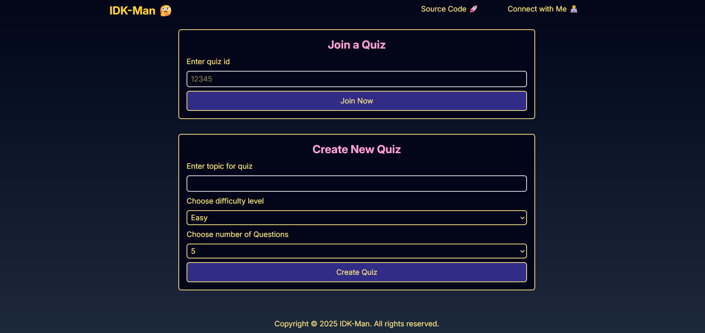
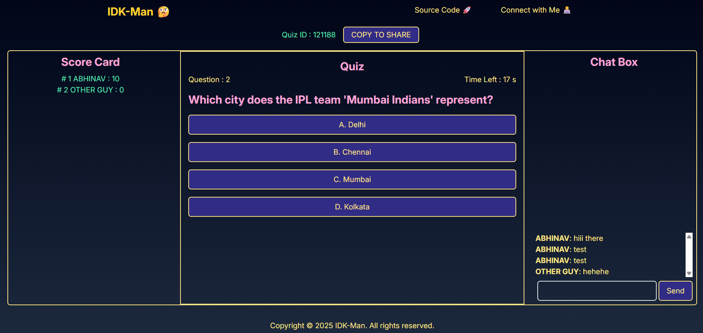
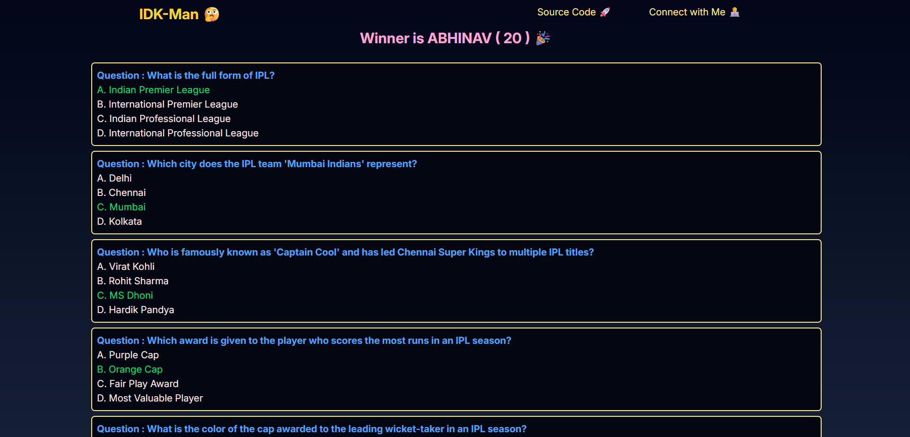

# 🧠 Brain Wars

**Brain Wars** is a real-time multiplayer quiz game built with **React**, **Node.js**, and **WebSockets**, powered by **LLMs** to generate fresh, topic-based quizzes on demand.  

## LIVE URL - https://brain-wars-web.netlify.app/

## 🚀 Features

- **AI-Generated Quizzes:**  
  Generate quizzes dynamically using LLMs based on topic, difficulty level, and number of questions.

- **Real-Time Multiplayer:**  
  Compete live with friends via WebSockets — no page refreshes, instant updates.

- **Room System:**  
  Create a quiz room, share the quiz ID, and let others join instantly.

- **Live Scoreboard:**  
  See player scores update in real time as answers roll in.

- **In-Game Chat:**  
  Talk, tease, and trash-talk — all within the same room.

- **Fast and Lightweight:**  
  Built with a focus on performance and minimal latency.

---

## 🧩 Tech Stack

**Frontend:**  
- React (Vite)  
- Tailwind CSS 

**Backend:**  
- Node.js  
- Express  
- WebSockets (Socket.IO)  
- LLM ( Gemini )

---

## 🕹️ How It Works

1. **Create a Quiz Room**  
   Choose a topic, level, and number of questions.  
   The backend calls the LLM to generate your custom quiz.

2. **Share the Quiz ID**  
   Send the room ID to friends or post it publicly.

3. **Join and Play**  
   Players join using the shared ID - the quiz starts once everyone is ready.

4. **Compete Live**  
   Each question appears in sync for all players. Scores and chat update live.

## UI Snapshots

---

